# Sofien Optic Lab — Complete User Workflow Catalog

Every user workflow in the application, derived from the code: `nav-config.ts` (VIEW_ROLES), `page.tsx` (view registry), the module pages/dialogs, and the services they call (order, repair, optician-shop-bill, cheque, purchase-invoice, stock, auth, audit, import, notifications).

## Contents

| # | Workflow | Roles |
|---|---|---|
| W1 | Login / session | all |
| W2 | First-run admin setup | public |
| W3 | Logout | all |
| W4 | Profile & password | all |
| W5 | Client management | admin, shop |
| W6 | Doctor management | admin, shop |
| W7 | Order creation (full flow) | admin, shop |
| W8 | Order status & payment actions | admin, shop |
| W9 | Quick sale (direct sale) | admin, shop |
| W10 | Billing & printing | admin, shop |
| W11 | Cheque / traite lifecycle | admin, shop (atelier: scoped) |
| W12 | Optician shop management | admin, atelier |
| W13 | Optician work order creation | admin, atelier |
| W14 | Work order processing | admin, atelier |
| W15 | Lens blank assignment | admin, atelier |
| W16 | Breakage declaration | admin, atelier |
| W17 | Lens blanks inventory | admin, atelier (read: +shop) |
| W18 | Optician billing & grouping | admin, atelier |
| W19 | Supplier (fournisseur) management | all (entity-scoped) |
| W20 | Purchase invoices & supplier grouping | admin, shop (+atelier via Invoices) |
| W21 | Retail stock & QR codes | admin, shop |
| W22 | CSV import wizard | admin, shop |
| W23 | Reports & audit logs | all / admin |
| W24 | Notifications & alerts | all (type-filtered) |

---

## 0. Role access matrix

| View | admin | shop | atelier |
|---|---|---|---|
| Dashboard, Reports, Settings | ✓ | ✓ | ✓ |
| Fournisseurs | ✓ | ✓ | ✓ |
| Clients, Doctors | ✓ | ✓ | — |
| Stock, Orders, Billing, Cheques | ✓ | ✓ | — |
| Purchase invoices, Import, QR lookup | ✓ | ✓ | — |
| Lens blanks | ✓ | — | ✓ |
| Atelier work orders | ✓ | — | ✓ |
| Optician shops | ✓ | — | ✓ |
| Invoices (optician + supplier bills) | ✓ | — | ✓ |
| Audit logs | ✓ | — | — |

Role behavior: shop sees **cost prices** for lens blanks, **free** repair-service lines, and the stock page hides the `verre` category; item prices are read-only for shop. Dashboard/Reports auto-split by entity (`shop` vs `atelier`). Repair-services and lens-brands catalogs: readable by all, writable by admin + atelier. The atelier role is **hard-scoped server-side** on cheque endpoints to optician-bill/supplier instruments only.

---

## W1 — Login / session

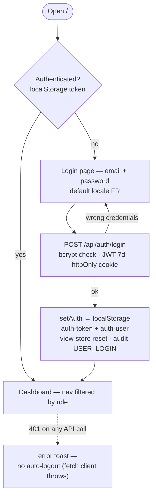

## W2 — First-run admin setup

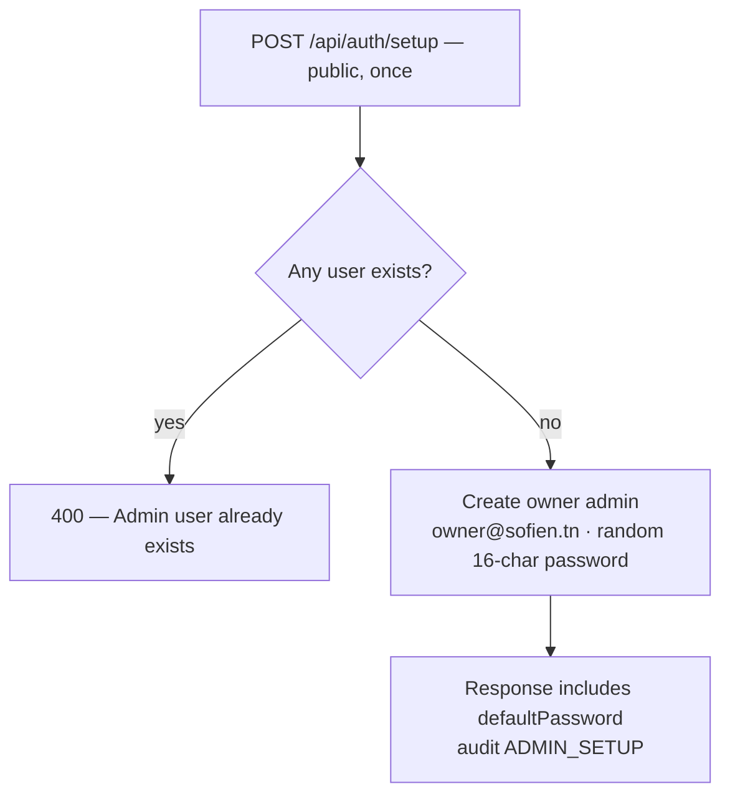

## W3 — Logout

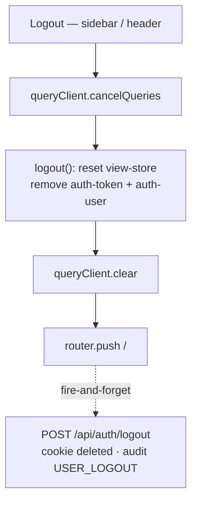

## W4 — Profile & password (Settings, all roles)

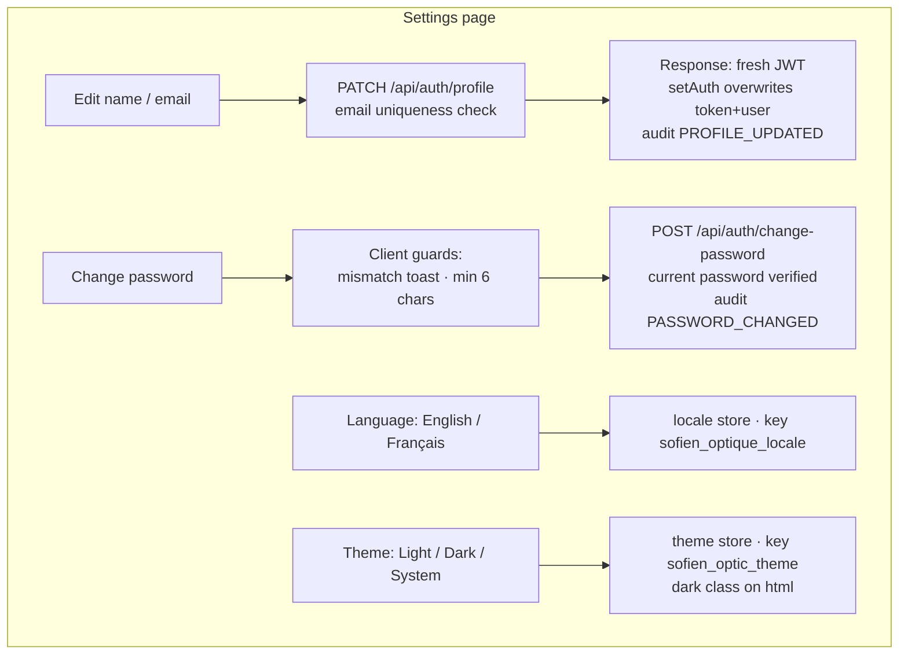

Admin/atelier also get catalog CRUD cards here: **Lens brands** and **Repair services** (name + defaultPrice) — list / create / rename / delete.

---

## W5 — Client management (admin, shop)

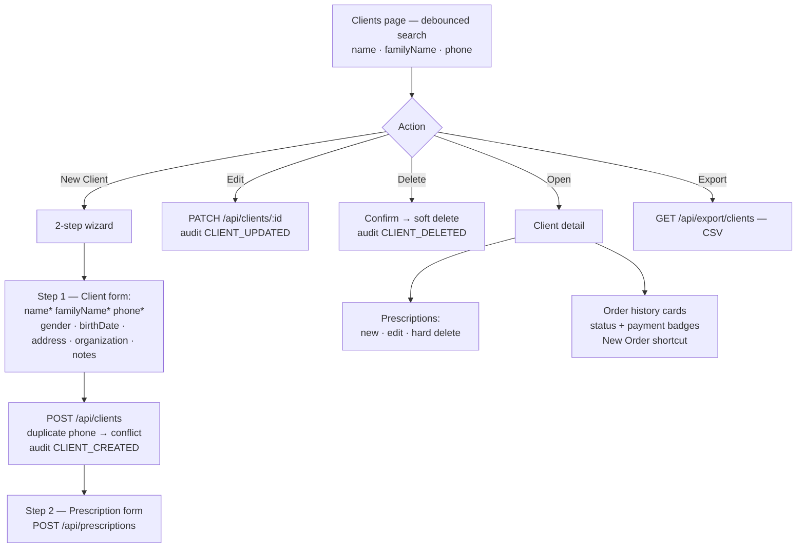

## W6 — Doctor management (admin, shop)

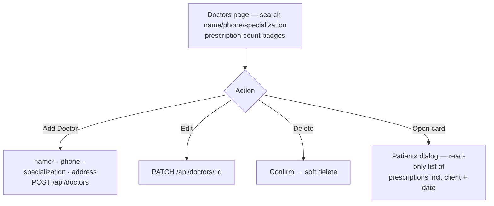

## W7 — Order creation (admin, shop)

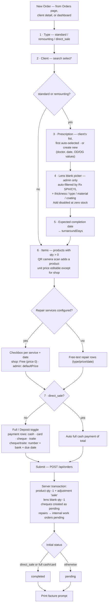

## W8 — Order status & payment actions (dashboard + order detail)

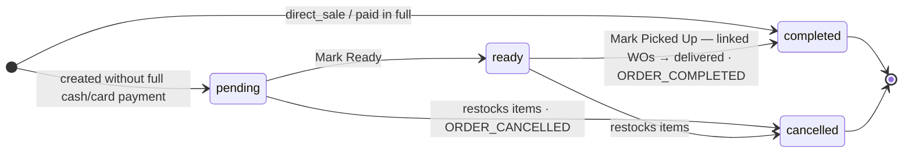

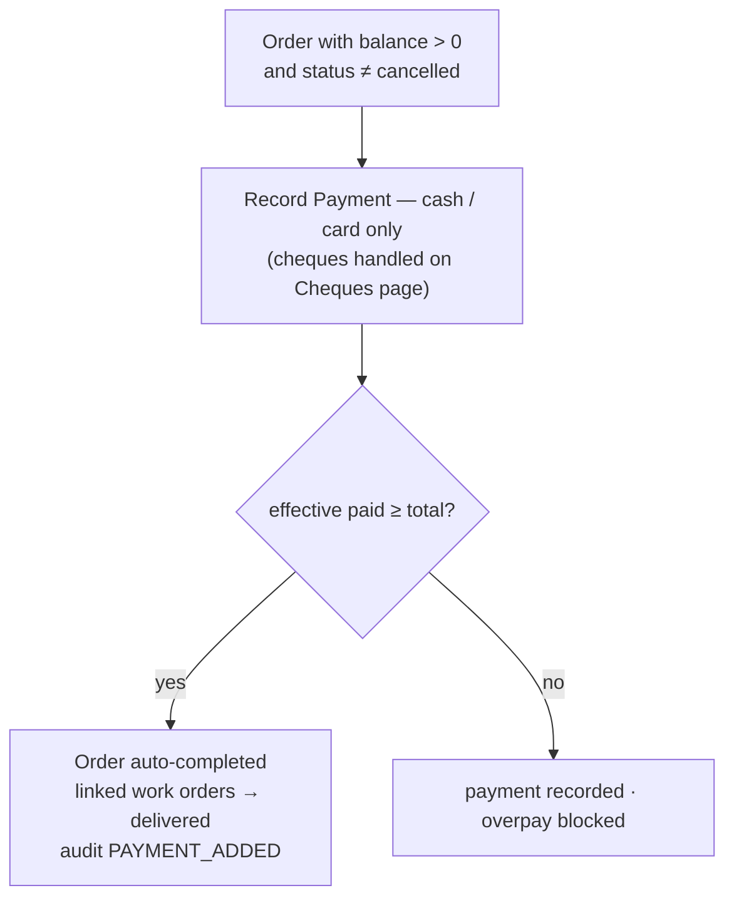

Note: a delete-order API exists (restock + soft delete + `ORDER_DELETED`) but **no UI button is wired** — dead-end listed in §Dead-ends.

## W9 — Quick sale

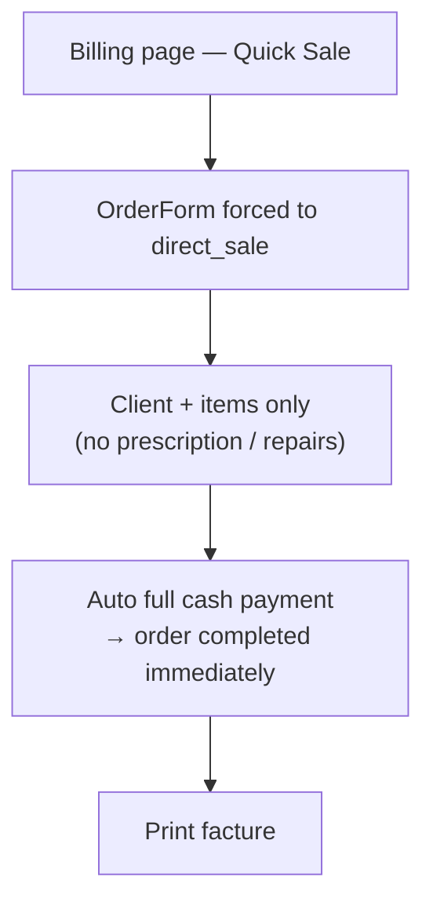

## W10 — Billing & printing (admin, shop)

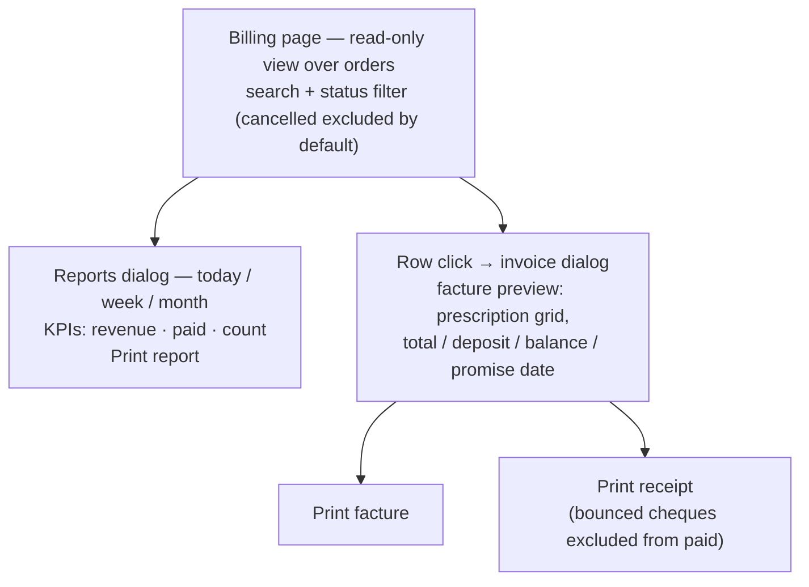

## W11 — Cheque / traite lifecycle

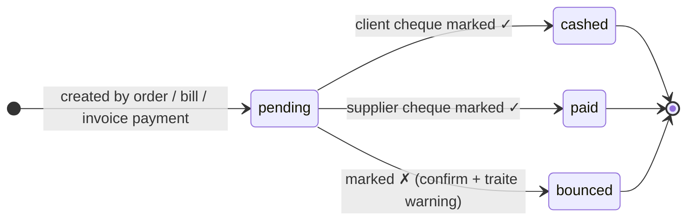

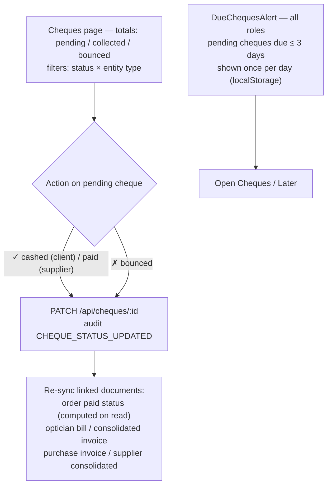

Atelier users are server-scoped to optician-bill and supplier cheques only; the cheques *view* is admin/shop.

---

## W12 — Optician shop management (admin, atelier)

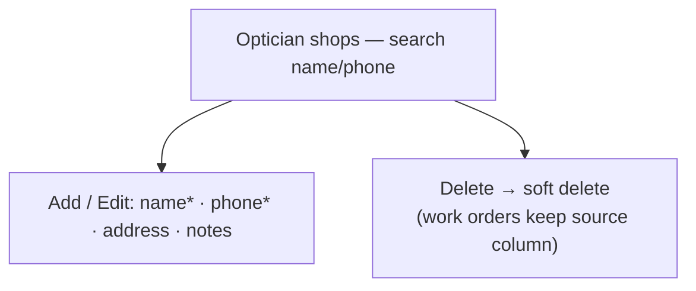

## W13 — Optician work order creation (admin, atelier)

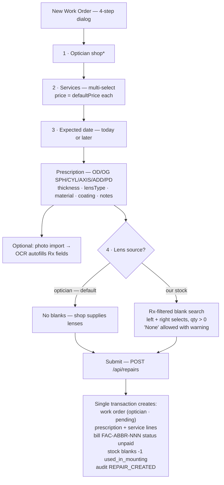

## W14 — Work order processing (admin, atelier)

Queue sorted by expected completion date; filters: status tabs, source (`internal` / `optician` — persisted column, safe when a shop was deleted), search by client or shop; due-date badges (overdue / today / days left).

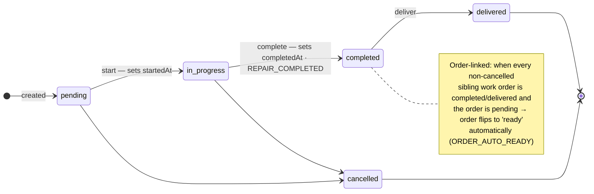

Payment block in the detail dialog: with a bill → bill badge + payments via bill; without (internal) → work-order ledger (servicePrice + lensBlankPrice, status pending/partial/paid) → cash payment (`WO_PAYMENT_RECORDED`), delegated to the bill when one exists.

## W15 — Lens blank assignment (admin, atelier)

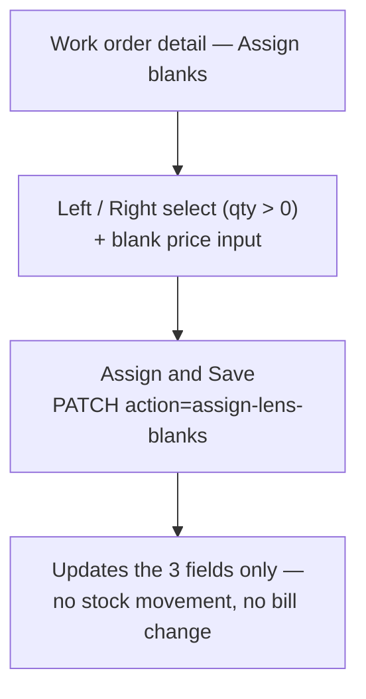

## W16 — Breakage declaration (admin, atelier)

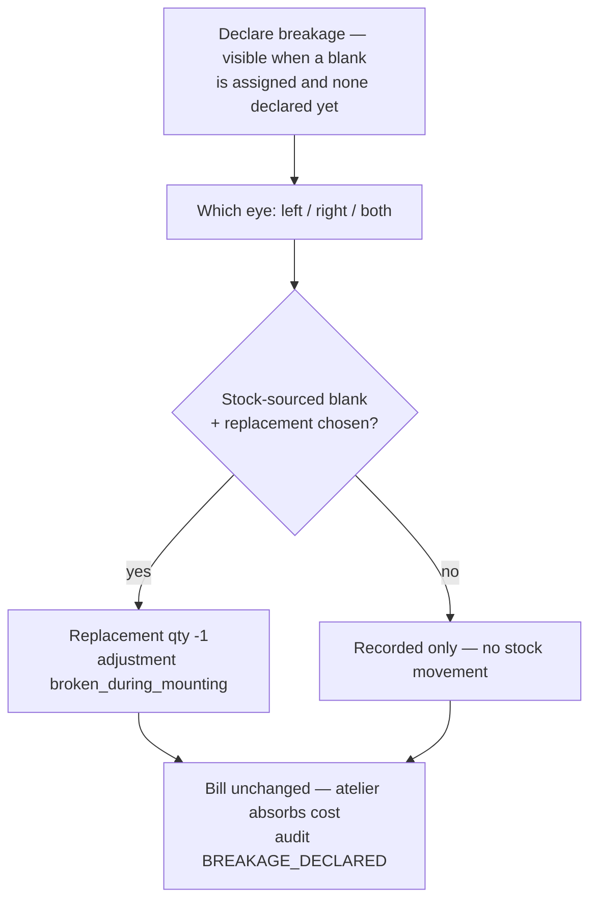

## W17 — Lens blanks inventory (admin, atelier; shop has read-only API access)

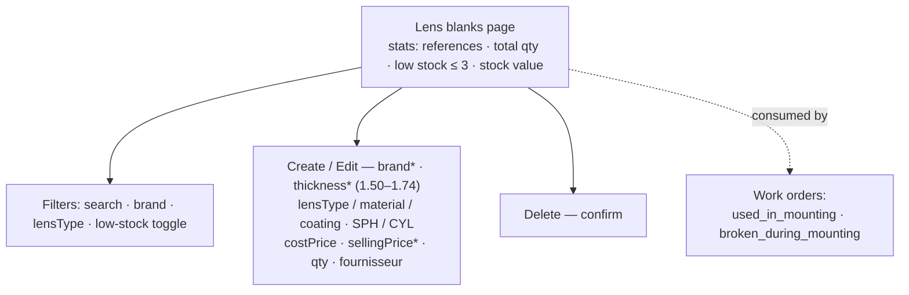

Note: an `adjust-stock` API exists (reasoned adjustments + ledger) but **no UI calls it** — see §Dead-ends.

## W18 — Optician billing & grouping (admin, atelier)

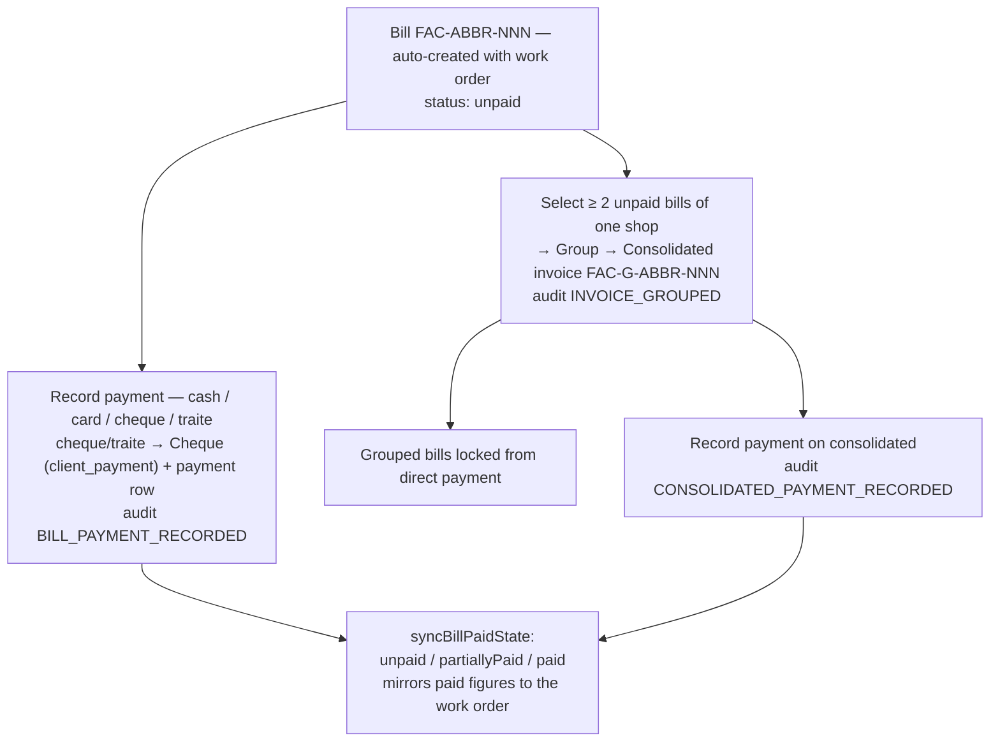

The Invoices page hosts 3 tabs: **Opticiens** (bills + consolidated, per-shop outstanding cards, group/payment/print), **Fournisseurs** (see W20), **Echeances** (cheque due dates, see W11).

## W19 — Supplier management (all roles, entity-scoped)

```mermaid
flowchart TD
    F["Fournisseurs — entity fixed by role<br/>atelier → atelier, others → shop"] --> S["Search name/phone · export CSV"]
    F --> A["Add / Edit: name* · phone · address · email · tax ID"]
    F --> P["Row click → supplier products dialog<br/>(their stock items, sold/unsold filter)"]
    F --> D["Delete → soft delete"]
```

## W20 — Purchase invoices & supplier grouping

```mermaid
flowchart TD
    PI["Purchase invoices (page: admin/shop · API: + atelier)<br/>entity fixed by role · payment-status filter"] --> N["New invoice — number auto-generated<br/>FAC-ABBR-NNN per fournisseur + entity"]
    N --> IT["Items per category — qty × unit cost<br/>(does NOT move product stock)"]
    N --> PM["Payments at creation — cash / cheque / traite<br/>cash counted immediately · cheques pending"]
    PI --> V["Preview dialog → Record payment<br/>audit SUPPLIER_INVOICE_PAYMENT_RECORDED"]
    PI --> G["Group ≥ 2 unpaid invoices of one fournisseur<br/>→ Supplier consolidated FAC-G-ABBR-NNN<br/>audit SUPPLIER_INVOICE_GROUPED"]
    G --> GP["Consolidated payment<br/>audit SUPPLIER_CONSOLIDATED_PAYMENT_RECORDED"]
```

## W21 — Retail stock & QR codes (admin, shop)

```mermaid
flowchart TD
    S["Stock page — filters: search · category<br/>(verre hidden for shop) · stock status<br/>export CSV"] --> NP["New product / Edit"]
    NP --> F["Per-category form:<br/>lunette · lentille · verre (lens params) · accessory ·<br/>nettoyant lentilles / monture<br/>cost · price* · qty · fournisseur"]
    F --> API["POST / PATCH — QR auto-generated<br/>SOPT-timestamp-random · audit PRODUCT_CREATED / UPDATED"]
    S --> QR["QR dialog — hang-tag + print label"]
    S --> DEL["Delete — audit PRODUCT_DELETED"]
    S --> SCAN["Order form: QR camera scan → item added"]
    QL["QR lookup page — enter / scan code"] --> LK["Product card result<br/>or 'Product not found'"]
```

## W22 — CSV import wizard (admin, shop)

```mermaid
flowchart TD
    W["Import — entity: clients / fournisseurs"] --> S1["1 · Upload CSV<br/>auto column mapping (FR/EN/WinDev aliases)"]
    S1 --> S2["2 · Map columns<br/>clients required: name · familyName · phone"]
    S2 --> S3["3 · Preview — POST /api/import<br/>duplicate detection by phone (clients)"]
    S3 --> S4["4 · Confirm — PUT /api/import<br/>per-row failures collected, not fatal"]
    S4 --> D["Done: success + failure toasts<br/>row-error list · re-import · export CSV"]
```

## W23 — Reports & audit logs

**Reports** (all roles; period: today / week / month / year / all, with ▲▼ deltas):
- admin sees **Shop reports**: revenue/profit KPIs, monthly trend, order-type donut, payment mix, receivables, collections (days-to-cash, bounce rate), top clients, doctor ranking, SPH/CYL demand bands, supplier balances, restock list, stock health, sales heatmaps, order-value buckets.
- atelier sees **Atelier reports**: revenue, completed WOs, avg turnaround, breakage rate, backlog + aging buckets, partner scorecard per shop, lens usage vs stock, low-blank alerts, revenue by optician.

```mermaid
flowchart TD
    R["Reports page"] --> E{"role"}
    E -- "admin" --> SH["Shop entity dashboard"]
    E -- "shop" --> SH
    E -- "atelier" --> AT["Atelier entity dashboard"]
    SH & AT --> P["Period select + delta comparison"]
```

**Audit logs** (admin only): text search on action, entity-type dropdown, date range, page navigation, expandable JSON metadata. Recorded actions include: `USER_LOGIN/LOGOUT`, `ADMIN_SETUP`, `PASSWORD_CHANGED`, `PROFILE_UPDATED`, `CLIENT_CREATED/UPDATED/DELETED`, `PRODUCT_CREATED/UPDATED/DELETED`, `ORDER_CREATED/COMPLETED/CANCELLED/DELETED`, `PAYMENT_ADDED`, `ORDER_AUTO_READY`, `REPAIR_CREATED/COMPLETED`, `BREAKAGE_DECLARED`, `WO_PAYMENT_RECORDED`, `BILL_PAYMENT_RECORDED`, `CHEQUE_STATUS_UPDATED`, `INVOICE_GROUPED`, `CONSOLIDATED_PAYMENT_RECORDED`, `SUPPLIER_INVOICE_GROUPED`, `SUPPLIER_CONSOLIDATED_PAYMENT_RECORDED`, `SUPPLIER_INVOICE_PAYMENT_RECORDED`.

## W24 — Notifications & alerts

```mermaid
flowchart TD
    POLL["Bell polls GET /api/notifications<br/>every 15 s"] --> ROLE{"role"}
    ROLE -- "admin" --> A5["all 5 alert types"]
    ROLE -- "shop" --> S4["4 — no pending_repair"]
    ROLE -- "atelier" --> T1["pending_repair only"]
    A5 --> CLICK["Click → role-checked deep link"]
    S4 --> CLICK
    T1 --> CLICK
```

| Alert type | Trigger | Deep link | Roles |
|---|---|---|---|
| low_stock | products qty ≤ 3 | stock | admin, shop |
| pending_repair | work orders pending | atelier-work-orders | admin, atelier |
| ready_order | orders ready | orders | admin, shop |
| ready_optician_work | optician WOs completed | atelier-work-orders | admin, shop |
| pending_payment | cheques due ≤ 7 days | billing | admin, shop |

---

## Cross-cutting money rule

```mermaid
flowchart LR
    P["Payment recorded"] --> M{"method"}
    M -- "cash / card" --> E["counts immediately"]
    M -- "cheque / traite" --> Q["Cheque row — pending"]
    Q -- "cashed / paid" --> E
    Q -- "bounced" --> X["never counts"]
    E --> ST["status recompute:<br/>unpaid / partiallyPaid / paid"]
    E --> OV["overpay blocked — epsilon 0.001"]
```

"Effective paid" = cash + card + **cleared** cheques only. All paid badges (orders, bills, invoices) derive from this.

## Known workflow dead-ends (as built)

| Gap | Detail |
|---|---|
| Order delete unreachable | API + hook exist (`ORDER_DELETED`, restock), no UI button wired |
| No product stock-adjustment UI | `StockAdjustmentReason` (restock/damage/adjustment/sale) unused by UI; qty set directly on the product form |
| Lens-blank adjust-stock unused | API exists (reasoned ledger entries), no UI button |
| Login error message | Wrong credentials always surface as generic 'Connection error' |
| 401 does not auto-logout | Expired token just toasts errors until manual logout |
| Clients gender filter | Filter state exists, no UI control wired |
| Purchase-invoice search box | Rendered but not wired |
| Cheques view vs API | Atelier can read scoped cheque APIs but cannot open the cheques view |
