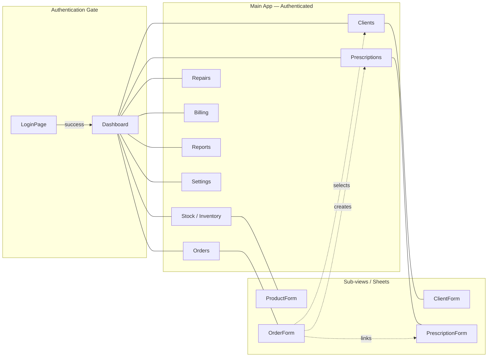
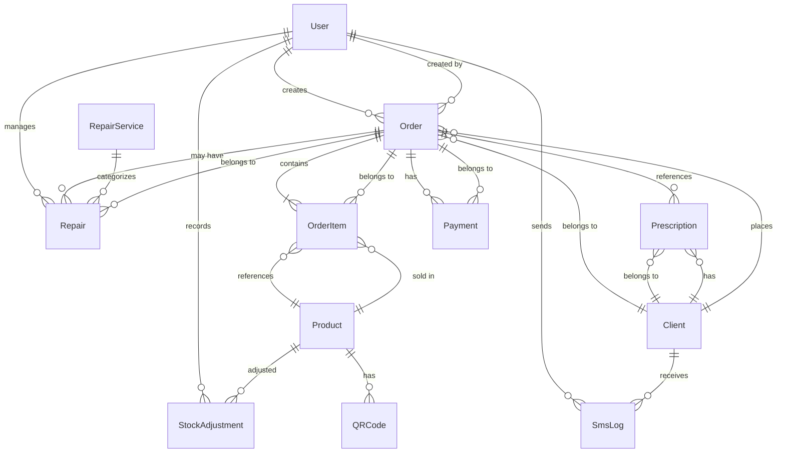

# Sofien Optic — UI/UX Project Context Document

> **Purpose:** Onboard a Senior Product Designer to a future redesign of the Sofien Optic POS/ERP system.  
> **Author:** AI code analysis · June 2026  
> **Status:** Pre-redesign audit — all statements grounded in the actual codebase unless marked `[SPECULATIVE]`.

---

## 1. Project Overview

Sofien Optic is a **single-user, browser-based Point-of-Sale (POS) and practice management system** for a small optical shop in Tunisia. It replaces paper-based workflows and generic tools with a purpose-built digital solution.

**Key facts:**
- Owner-operated single store
- French-language primary UI (English also supported via i18n)
- Currency: Tunisian Dinar (TND), displayed with 3 decimal places
- Self-hosted (localhost LAN) — not deployed to the public internet
- SQLite database file stored on the machine running the server
- Single page application (SPA) pattern built on Next.js, but all navigation is client-side via Zustand state — **not URL routing**

---

## 2. Target Users

| Role | Description | Needs |
|------|-------------|-------|
| **Shop Owner (Sofien)** | Primary and only user | Fast order entry, client management, inventory tracking, repair lifecycle, daily sales reports, invoicing |
| **Occasional fill-in staff** | Might use the system when the owner is away | Simple, self-explanatory UI for basic tasks like marking orders ready |

**The system has no multi-user support, no RBAC, and no user management UI.** Authentication is a simple email+password login with a hardcoded default setup route.

---

## 3. Tech Stack

| Layer | Technology | Notes |
|-------|-----------|-------|
| Framework | **Next.js 16** (App Router) | Single route `/` — SPA navigation |
| Language | **TypeScript** (strict mode) | |
| Styling | **Tailwind CSS v4** (with `@tailwindcss/postcss`) | Config-free, CSS-first |
| UI Library | **shadcn/ui** (New York / `radix-nova` style) | Components customized and stored locally |
| Icons | **Lucide React** | |
| Animations | **framer-motion** | Used for page transitions |
| Toasts | **sonner** | Toast notification library |
| State (global) | **Zustand** | 3 stores: auth, view (nav), locale |
| State (server) | **React `useState`/`useEffect`** | No TanStack Query, no SWR |
| Database | **SQLite** (via Prisma ORM) | File-based, no external DB server |
| Auth | **jose** (JWT) + **bcryptjs** | Token stored in `localStorage`, sent via HTTP headers |
| Validation | **zod** (server-side + form schemas) | |
| Classnames | **clsx** + **tailwind-merge** (via `cn()` utility) | |
| Forms | **Native HTML** (no react-hook-form / Formik) | |
| SMS | **Custom `lib/sms.ts`** | Currently disabled (logs to DB only) |

**Notable absences:**
- No testing framework installed (no Jest, Vitest, Playwright, Cypress)
- No i18n framework — custom hook `useTranslation` with JSON key-value files
- No URL router for app views — all view switching is SPA via Zustand

---

## 4. Architecture

### 4.1 High-level Flow

```mermaid
flowchart TD
    subgraph Browser [Browser — Next.js Client]
        A[page.tsx] --> B[Zustand view-store]
        B --> C[AuthStore + LocaleStore]
        B --> D{Which view?}
        D -->|dashboard| E[DashboardPage]
        D -->|clients| F[ClientsPage]
        D -->|stock| G[StockPage]
        D -->|prescriptions| H[PrescriptionsPage]
        D -->|orders| I[OrdersPage]
        D -->|repairs| J[RepairsPage]
        D -->|billing| K[BillingPage]
        D -->|reports| L[ReportsPage]
        D -->|settings| M[SettingsPage]
        D -->|auth| N[LoginPage]
        
        E --> O[fetch /api/*]
        F --> O
        G --> O
        H --> O
        I --> O
        J --> O
        K --> O
        L --> O
    end

    subgraph Server [Next.js API Routes]
        O --> P[/api/clients/*]
        O --> Q[/api/orders/*]
        O --> R[/api/repairs/*]
        O --> S[/api/billing/*]
        O --> T[/api/prescriptions/*]
        O --> U[/api/stock/*]
        O --> V[/api/reports/*]
        O --> W[/api/auth/*]
        
        P --> X[Prisma Client]
        Q --> X
        R --> X
        S --> X
        T --> X
        U --> X
        V --> X
        W --> X
        
        X --> Y[(SQLite .db file)]
    end
```

### 4.2 Data Model (Prisma Schema)

12 models, 5 enums. Key relationships:

```
User ── has many ──> Order, Repair, SmsLog
Client ── has many ──> Prescription, Order, SmsLog
Prescription ── belongs to ──> Client, optionally linked to Order
Order ── has many ──> OrderItem, Payment
Order ── belongs to ──> Client, User
Order ── has one ──> Prescription (optional)
OrderItem ── belongs to ──> Order, Product
Payment ── belongs to ──> Order
Repair ── belongs to ──> Order, RepairService
RepairService ── has many ──> Repair
Product ── has many ──> OrderItem, StockAdjustment
StockAdjustment ── belongs to ──> Product, User
QRCode ── belongs to ──> Product
```

**Order Types (`OrderType` enum):**
- `standard` — Full eyewear order with prescription, new frame + lenses
- `remounting` — Client brings own frame, shop provides new lenses
- `direct_sale` — Quick sale of existing product (no prescription, no turnaround)

**Order Status (`OrderStatus` enum):**
- `pending` — Just created, being processed
- `ready` — Ready for pickup
- `completed` — Picked up by client, payment finalized
- `cancelled` — Order voided

**Payment Method (`PaymentMethod` enum):**
- `cash`, `card`, `cheque`, `other`

**Repair Status:**
- `pending` → `completed` (no in-progress state)

---

## 5. Navigation System

### 5.1 How Navigation Works

All view switching is handled by **Zustand's `useViewStore`**. The store maintains:
- A `currentView` string (e.g., `'orders'`, `'clients'`, `'orders-form'`)
- A `viewHistory` array for back-navigation
- `selectedOrderId`, `selectedClientId`, `selectedRepairId`, `selectedPrescriptionId` for passing context between views
- A `viewParams` object for additional parameters

### 5.2 Navigation Tree



**Implemented views (in `page.tsx`):**
| `view` value | Component | Sheet-based form? |
|---|---|---|
| `'auth'` | `LoginPage` | — |
| `'dashboard'` | `DashboardPage` | — |
| `'clients'` | `ClientsPage` | `ClientForm` opens in sheet |
| `'clients-form'` | `ClientForm` (standalone, not sheet) | — |
| `'stock'` | `StockPage` | `ProductForm` opens in sheet |
| `'stock-form'` | `ProductForm` (standalone, not sheet) | — |
| `'prescriptions'` | `PrescriptionsPage` | `PrescriptionForm` opens in sheet |
| `'prescriptions-form'` | `PrescriptionForm` | — |
| `'orders'` | `OrdersPage` | `OrderForm` opens in sheet |
| `'orders-form'` | `OrderForm` (standalone) | — |
| `'repairs'` | `RepairsPage` | — |
| `'billing'` | `BillingPage` | — |
| `'reports'` | `ReportsPage` | — |
| `'settings'` | `SettingsPage` | — |

**Views defined in `view-store` but NOT implemented in `page.tsx`:**
- `'orders-detail'`
- `'repairs-form'`
- `'billing-detail'`
- `'billing-form'`
- `'reports-detail'`
- `'settings-detail'`
- `'clients-detail'`

These are vestigial from an earlier architecture concept. Currently, all detail/edit is handled via sheets/dialogs within the list view, not by navigating to a separate detail view.

### 5.3 Sidebar Navigation Items

Hardcoded in `Sidebar.tsx`:
| Icon | Label (t key) | View | Order |
|------|------|------|-------|
| LayoutDashboard | `nav.dashboard` | `dashboard` | 1 |
| Users | `nav.clients` | `clients` | 2 |
| Package | `nav.stock` | `stock` | 3 |
| Eye | `nav.prescriptions` | `prescriptions` | 4 |
| ShoppingCart | `nav.orders` | `orders` | 5 |
| Wrench | `nav.repairs` | `repairs` | 6 |
| Receipt | `nav.billing` | `billing` | 7 |
| BarChart3 | `nav.reports` | `reports` | 8 |
| Settings | `nav.settings` | `settings` | 9 |

Active state is determined by `currentView.startsWith(item.view)`.

---

## 6. Feature Deep-Dive

### 6.1 Order Management (Core Workflow)

The order system is the heart of the application. It supports three scenarios:

```mermaid
flowchart TD
    subgraph Scenario1 [Scenario A: Full Eyewear Order]
        A1[Walk-in client] --> A2{Existing client?}
        A2 -->|Yes| A3[Select client]
        A2 -->|No| A4[Create client in form]
        A3 --> A5[Select standard order type]
        A4 --> A5
        A5 --> A6[Search/select frame product]
        A6 --> A7{Has valid prescription?}
        A7 -->|Yes - recent| A8[Select existing prescription]
        A7 -->|Yes - new| A9[Enter new prescription]
        A7 -->|No prescription needed| A10[Enter basic details]
        A8 --> A11[Set price & turnaround]
        A9 --> A11
        A10 --> A11
        A11 --> A12[Save order → pending]
        A12 --> A13[Work completes → mark ready]
        A13 --> A14[Client picks up → mark completed]
        A14 --> A15[Payment recorded at completion]
    end

    subgraph Scenario2 [Scenario B: Remounting (own frame)]
        B1[Client brings own frame] --> B2[Select client]
        B2 --> B3[Select remounting type]
        B3 --> B4[Enter lens product]
        B4 --> B5{Prescription?}
        B5 -->|Yes| B6[Enter prescription]
        B5 -->|No| B7[Basic order]
        B6 --> B8[Save → pending]
        B7 --> B8
    end

    subgraph Scenario3 [Scenario C: Direct Sale]
        C1[Quick sale] --> C2[Select direct_sale type]
        C2 --> C3[Pick product from stock]
        C3 --> C4[Set quantity & price]
        C4 --> C5[Save → auto-completed]
    end
```

### 6.2 Repair Workflow

```mermaid
flowchart TD
    R1[Client brings item for repair] --> R2[Select client]
    R2 --> R3[Select repair service<br/>e.g., Nose pad, Temple, Cleaning]
    R3 --> R4[Set price & notes]
    R4 --> R5[Save repair → pending]
    R5 --> R6[Repair completed]
    R6 --> R7[Mark as completed]
    R7 --> R8{Auto-SMS enabled?}
    R8 -->|Yes| R9[SMS sent to client<br/>"Your repair is ready"]
    R8 -->|No / disabled| R10[SMS logged in DB only]
```

### 6.3 Billing / Invoicing

- Lists all completed orders
- Shows full invoice data (client, items, payments, prescription details)
- Printable invoice view (opens in a new window using `window.open` with an HTML template)
- Invoice includes: shop name, logo placeholder, client details, line items, subtotal, discount, tax, total, payment summary
- **Period-based filtering** (today, this week, this month, this year, all time)
- Quick-sale button from billing page (shortcut to OrderForm with `direct_sale` pre-selected)

### 6.4 Inventory (Stock)

- Product list with search by name/brand/model
- Stock level tracking (quantity field)
- Low-stock detection (threshold: ≤5 units)
- Categories: `eyewear`, `lens`, `accessory`
- Product form: name, brand, model, category, price, quantity

### 6.5 Client Management

- Client list with search (name, phone, family name)
- Client fields: name, family name, phone, address, gender
- Client detail shows linked orders, prescriptions, and repairs
- New client can be created inline during order creation

### 6.6 Prescriptions

- Optical prescription storage
- Fields: SPH, CYL, Axis, Add, PD (left and right eyes)
- Doctor name field
- Linked to a client
- Can be selected during order creation (or created anew)

### 6.7 Reports

- Period-based KPIs: total revenue, total orders, total clients, total products, low stock count, pending repairs
- Revenue breakdown by order type
- Orders breakdown by status

### 6.8 Dashboard

- Same KPIs as Reports page
- Quick action buttons: New Client, New Order, New Product, New Repair
- Most recent orders table
- Revenue chart (last 7 days)

### 6.9 Authentication

- Simple login page with email + password
- `/api/auth/setup` creates a default admin user (`admin@sofien.tn` with configurable password)
- JWT token stored in `localStorage`, sent as `Authorization: Bearer <token>` header
- Token expires in 7 days
- No password reset, no registration UI — setup is a one-time API call

### 6.10 SMS Notifications

- `lib/sms.ts` has a `sendRepairReadySms()` function
- Currently configured as `enabled: false, provider: 'log'` — SMS messages are only written to the `SmsLog` table, not actually sent
- When a repair is marked completed, `sendRepairReadySms()` is called automatically
- Message template: `"Bonjour {name} {familyName}, votre réparation ({serviceName}) est terminée. Vous pouvez venir la récupérer chez Sofien Optic. Merci."`

### 6.11 i18n

- Custom implementation (no react-i18next / next-intl)
- Two JSON files: `eng.json` and `fr.json`
- 240+ translation keys across both files
- Keys use dot notation: `orders.type_standard`, `common.pending`, etc.
- `useTranslation()` hook returns `{ t, locale, setLocale }`
- Language toggle in Settings page (English / Français)

---

## 7. UI/UX Analysis

### 7.1 Current Strengths

- **Green primary theme** (`#519651`) — appropriate for an optical/medical context (trust, health, nature)
- **Consistent spacing** — Tailwind spacing scale used throughout
- **Responsive sidebar** — collapses to mobile nav with bottom tabs
- **Dark mode support** — CSS variables defined for both `light` and `dark`
- **Toast feedback** — sonner toasts used for success/error states
- **Transition animations** — framer-motion page transitions (fade + slight vertical)
- **Search-as-you-type** — `/api/clients/search` and client-side product search
- **SearchSelect combobox** — custom combobox for selecting from long lists with search
- **Confirmation dialogs** — `ConfirmDialog` component used for destructive actions
- **Sheet-based forms** — forms open in side panels (sheets) rather than new pages, keeping context visible

### 7.2 Current Weaknesses / UX Issues

| Issue | Location | Impact |
|-------|----------|--------|
| **No navigation back** — some sheets don't close intuitively | OrderForm, ClientForm | User may be confused how to return to list |
| **No undo** — destructive actions (cancel order, delete) have no undo | Orders, Repairs | High risk of data loss |
| **Status unclear** — no visual progress indicator for order lifecycle | Orders | User can't see at a glance how long an order has been in `pending` |
| **No empty states** — empty lists show nothing or raw "loading" | All pages | First-time user sees blank page |
| **No pagination** — all lists load and render all records | Clients, Orders, Stock | Will degrade with large datasets |
| **No offline support** — no PWA, no service worker | Entire app | Not usable if server is down |
| **No keyboard shortcuts** — all interactions require mouse | Entire app | Slows down high-volume entry |
| **Responsive gaps** — some pages don't adapt well on mobile | OrderForm, BillingPrint | Layout breaks at small widths |
| **No form validation feedback** — basic HTML validation only | OrderForm | User may submit incomplete data |
| **No row actions in tables** — must click into detail view | Clients, Orders | Extra clicks for common actions |
| **Logo placeholder only** — invoice print has a gray box instead of logo | Billing | Looks unprofessional |
| **Default password in code** — "changeme" fallback in `auth.ts` | Auth | Security concern if deployed |
| **No loading skeletons** — spinner or text "Loading..." only | All pages | Feels less polished |

---

## 8. Component Inventory

### 8.1 UI Primitives (`src/components/ui/`)

| Component | Built from | Notes |
|-----------|-----------|-------|
| `Badge` | Radix `Slot` + CVA | Variants: default, secondary, destructive, outline, ghost, link |
| `Button` | Radix `Slot` + CVA | Variants: default, destructive, outline, secondary, ghost, link; sizes: default, sm, lg, icon, icon-sm |
| `Card`, `CardHeader`, `CardTitle`, `CardDescription`, `CardContent` | Plain `div` | Layout components |
| `ConfirmDialog` | Radix `Dialog` | Title, description, confirm/cancel labels, destructive variant |
| `Dialog` | Radix `Dialog` | Full dialog with overlay, close button |
| `Input` | Plain `<input>` | Tailwind-styled with label support, error state |
| `Label` | Radix `Label` | Form label |
| `Select` | Radix `Select` | Native `<select>` fallback |
| `Separator` | Radix `Separator` | Horizontal/vertical |
| `Sheet` | Radix `Dialog` (aliased) | Side panel (top/right/bottom/left) |
| `SheetContent`, `SheetHeader`, `SheetFooter`, `SheetTitle`, `SheetDescription` | Sub-components | |
| `SearchSelect` | Custom | Combobox with search input and dropdown list |
| (No `Table`) | — | Tables are hand-coded with `<table>` or `<div>` grids |
| (No `Dropdown Menu`) | — | Not needed yet |

### 8.2 Layout Components

| Component | Purpose |
|-----------|---------|
| `AppShell` | Top-level wrapper: sidebar + header + main content + mobile nav |
| `Sidebar` | Left navigation with 9 items, active state highlighting, collapses on small screens |
| `Header` | Top bar with current view title + back button + logout |
| `MobileNav` | Bottom tab bar for mobile: Dashboard, Clients, Orders, Stock, More |

### 8.3 Page Components

| Page | Key Props/State | Notes |
|------|-----------------|-------|
| `LoginPage` | email, password, error, loading | Simple form, calls `/api/auth/login` |
| `DashboardPage` | KPI cards, recent orders, revenue chart | Hardcoded query params to `/api/reports?period=month` |
| `ClientsPage` | clients[], search, expanded client | Search by name/phone, expandable rows show linked orders |
| `ClientForm` | mode (create/edit), form fields, validation | Opens in sheet or standalone |
| `StockPage` | products[], search, low-stock filter | Searchable, category filter |
| `ProductForm` | mode (create/edit), zod-validated | Opens in sheet |
| `PrescriptionsPage` | prescriptions[], search | Selectable to prefill order form |
| `PrescriptionForm` | client selection, all optical fields | Opens in sheet |
| `OrdersPage` | orders[], filter (status/type) | Cards with status badges, detail expand, status actions |
| `OrderForm` | order type, client, products, prescription, price, turnaround | **Most complex form** (~500 lines), all three order type scenarios |
| `RepairsPage` | repairs[], filter | Status toggle, auto-SMS on complete |
| `BillingPage` | invoices[], period filter, selected invoice | Invoice detail in dialog, print view opens new window |
| `ReportsPage` | KPI cards, revenue by type, orders by status | Period selector, no charts |
| `SettingsPage` | language toggle, profile (non-functional), SMS info | Placeholder profile section |

---

## 9. Design System Audit

### 9.1 Colors (from `globals.css`)

| Token | Light | Dark | Usage |
|-------|-------|------|-------|
| `--background` | `oklch(1 0 0)` | `oklch(0.13 0 0)` | Page background |
| `--foreground` | `oklch(0.13 0 0)` | `oklch(0.93 0 0)` | Main text |
| `--primary` | `#519651` | `#519651` | Buttons, badges, active states |
| `--primary-foreground` | white | white | Text on primary |
| `--secondary` | `oklch(0.9 0 0)` | `oklch(0.27 0 0)` | Secondary buttons |
| `--destructive` | `oklch(0.58 0.19 27)` | `oklch(0.58 0.19 27)` | Delete/cancel actions |
| `--muted` | `oklch(0.9 0 0)` | `oklch(0.27 0 0)` | Subtle backgrounds |
| `--card` | `oklch(1 0 0)` | `oklch(0.13 0 0)` | Card background |
| `--border` | `oklch(0.88 0 0)` | `oklch(0.27 0 0)` | Borders |
| `--ring` | `#519651` | `#519651` | Focus rings |
| `--radius` | `0.5rem` | | Border radius |

**Primary color is a medium green (`#519651`)** — used for buttons, active sidebar, focus rings, badges. The color is consistent with an optical/medical brand identity.

### 9.2 Typography

- Base font: system UI font stack (`--font-sans`)
- Headings: `font-heading` class (same system stack, just a semantic alias)
- Scale: text-xs (0.75rem), text-sm (0.875rem), text-base (1rem), text-lg (1.125rem), text-2xl (1.5rem)
- Font weights: medium (500), semibold (600), bold (700)

### 9.3 Spacing

- Standard 4px base unit (Tailwind default)
- Page padding: `p-6` (1.5rem/24px)
- Card grid: `gap-4`
- Form fields: `space-y-2` label + input, `space-y-4` between fields
- List items: `gap-3` or `gap-4`

### 9.4 Shadows

- Card shadow: `shadow-sm`
- Dialog/Sheet: `shadow-lg`
- No custom shadows in the codebase — all Tailwind defaults

### 9.5 Component Patterns

| Pattern | Usage | Example |
|---------|-------|---------|
| KPI Card | `Card` + icon + large number | Dashboard, Reports |
| Table Row | `div.flex.items-center.justify-between` | All list views |
| Search Input | Full-width input with `Search` icon | Clients, Stock, Orders |
| Status Badge | `<Badge>` with conditional variant | Orders, Repairs |
| Action Buttons | Row of small icons (`Pencil`, `Trash2`, `Check`) | All list items |
| Dialog/Sheet | Forms open in sheet, detail views in dialog | Every form |
| Toast | `sonner.toast()` after mutations | CRUD operations |

### 9.6 Accessibility

- All interactive elements use Radix primitives (built-in ARIA)
- Focus-visible ring styles defined globally
- `sr-only` class used for screen-reader-only labels
- Color contrast: green on white for primary (passes WCAG AA for large text, borderline for small text)
- No keyboard navigation testing framework evident

---

## 10. File Structure Map

```
src/
├── app/
│   ├── api/
│   │   ├── auth/
│   │   │   ├── login/route.ts
│   │   │   ├── logout/route.ts
│   │   │   └── setup/route.ts
│   │   ├── billing/
│   │   │   └── route.ts
│   │   ├── clients/
│   │   │   ├── route.ts
│   │   │   ├── [id]/route.ts
│   │   │   └── search/route.ts
│   │   ├── orders/
│   │   │   ├── route.ts
│   │   │   └── [id]/route.ts
│   │   ├── prescriptions/
│   │   │   └── route.ts
│   │   ├── repairs/
│   │   │   ├── route.ts
│   │   │   └── [id]/route.ts
│   │   ├── reports/
│   │   │   └── route.ts
│   │   └── stock/
│   │       └── route.ts
│   ├── globals.css
│   ├── layout.tsx
│   └── page.tsx
├── components/
│   ├── auth/
│   │   └── LoginPage.tsx
│   ├── billing/
│   │   └── BillingPage.tsx
│   ├── clients/
│   │   ├── ClientForm.tsx
│   │   └── ClientsPage.tsx
│   ├── dashboard/
│   │   └── DashboardPage.tsx
│   ├── layouts/
│   │   ├── AppShell.tsx
│   │   ├── Header.tsx
│   │   ├── MobileNav.tsx
│   │   └── Sidebar.tsx
│   ├── orders/
│   │   ├── OrderForm.tsx
│   │   └── OrdersPage.tsx
│   ├── prescriptions/
│   │   ├── PrescriptionForm.tsx
│   │   └── PrescriptionsPage.tsx
│   ├── repairs/
│   │   └── RepairsPage.tsx
│   ├── reports/
│   │   └── ReportsPage.tsx
│   ├── settings/
│   │   └── SettingsPage.tsx
│   ├── stock/
│   │   ├── ProductForm.tsx
│   │   └── StockPage.tsx
│   └── ui/
│       ├── badge.tsx
│       ├── button.tsx
│       ├── card.tsx
│       ├── confirm-dialog.tsx
│       ├── dialog.tsx
│       ├── input.tsx
│       ├── label.tsx
│       ├── search-select.tsx
│       ├── select.tsx
│       ├── separator.tsx
│       └── sheet.tsx
├── hooks/
│   └── useTranslation.ts
├── i18n/
│   ├── eng.json
│   └── fr.json
├── lib/
│   ├── auth.ts
│   ├── db.ts
│   ├── sms.ts
│   ├── utils.ts
│   └── validators.ts
└── stores/
    ├── auth-store.ts
    ├── locale-store.ts
    └── view-store.ts
```

---

## 11. Key Data Flow Patterns

### 11.1 Fetch Pattern

Every page component follows this pattern:

```typescript
// 1. useState for data + loading
const [data, setData] = useState<DataType | null>(null)
const [loading, setLoading] = useState(true)

// 2. useEffect to fetch on mount
useEffect(() => {
    async function load() {
        const res = await fetch('/api/endpoint')
        if (res.ok) setData(await res.json())
        setLoading(false)
    }
    load()
}, [])

// 3. Loading state
if (loading) return <p>Loading...</p>
```

**No React Query, no SWR, no caching layer** — every page re-fetches on mount.

### 11.2 Mutation Pattern

```typescript
// Create
const res = await fetch('/api/endpoint', {
    method: 'POST',
    headers: { 'Content-Type': 'application/json' },
    body: JSON.stringify(data),
})

// After success: toast + refresh + close sheet
toast.success(t('common.saved'))
loadData() // re-fetch list
setOpen(false)
```

**No optimistic updates, no rollback.** Mutations are straightforward POST/PUT/DELETE with a full re-fetch afterward.

### 11.3 Auth Flow

```
LoginPage → POST /api/auth/login → { token } → store in localStorage
                                    ↓
                  Every subsequent fetch reads token from authStore
                                    ↓
                  API routes verify via verifyToken() helper
                                    ↓
                  If invalid → 401 → LoginPage shown
```

---

## 12. Translation Map (Key Prefixes)

| Prefix | English | French | Purpose |
|--------|---------|--------|---------|
| `nav.*` | sidebar items | same | Navigation labels |
| `common.*` | save, cancel, delete, search, loading, etc. | same | Generic UI labels |
| `clients.*` | client-related | clients-related | Client section |
| `stock.*` | stock-related | stock-related | Inventory section |
| `prescriptions.*` | prescription-related | prescription-related | Prescription section |
| `orders.*` | order types, statuses, fields | order-related | Order section |
| `orders.type_standard` | "Prescription Eyewear" | "Lunettes sur Mesure" | Order type label |
| `orders.type_remounting` | "Remounting" | "Remontage" | Order type label |
| `orders.type_direct_sale` | "Direct Sale" | "Vente Directe" | Order type label |
| `repairs.*` | repair-related | reparation-related | Repair section |
| `billing.*` | billing-related | facturation-related | Billing section |
| `reports.*` | report periods, labels | rapport-related | Reports section |
| `dashboard.*` | KPI labels | tableau-de-bord | Dashboard |
| `settings.*` | language, profile, SMS | parametres | Settings |
| `auth.*` | login-related | authentification | Auth section |
| `sms.*` | SMS templates | sms | Notification strings |
| `errors.*` | error messages | erreurs | Error feedback |

---

## 13. Data Model Diagram



---

## 14. Known Issues & Technical Debt

| Issue | Location | Notes |
|-------|----------|-------|
| `Dialog` imported from wrong path in some components | Various | `@radix-ui/react-dialog` vs `radix-ui` — works but inconsistent |
| `Sheet` re-aliases `DialogPrimitive` as `SheetPrimitive` | `sheet.tsx` | Intentional but unusual pattern |
| Empty states not handled | All list pages | No "No clients" / "No orders" message |
| No input debouncing on search | Clients, Stock | API call on every keystroke |
| `RepairsPage` re-fetches after status change but no loading indicator | `RepairsPage.tsx` | Brief flash of stale data |
| `BillingPage` hardcodes TND currency formatting | `BillingPage.tsx` | `parseFloat(amount).toFixed(3) + ' TND'` — should be centralized |
| `useEffect` data fetching — no cleanup | All pages | Race condition on rapid navigation |
| Invoice print window has no print button — relies on browser Ctrl+P | `BillingPage.tsx` | Discoverability issue |
| `next.config.ts` is empty | Root | No image optimization, no redirects, no headers configured |
| `AGENTS.md` references `node_modules/next/dist/docs/` | Root | Local documentation that may not exist in all environments |

---

## 15. Future Considerations (From PRD + Codebase Gaps)

| Topic | Status | Notes |
|-------|--------|-------|
| Multi-user / staff management | Not implemented | Single-user only |
| QR code scanning for products | Schema exists, no UI | `QRCode` model is unused in components |
| Real SMS provider integration | Disabled in code | `lib/sms.ts` has provider abstraction ready |
| Barcode/label printing | Not implemented | No printer integration |
| Loyalty / discount system | Not implemented | No loyalty features |
| Appointment scheduling | Not implemented | No calendar/scheduling |
| Supplier / purchase order management | Not implemented | No procurement flow |
| Advanced analytics / charts | Basic KPIs only | No chart library (no recharts/chart.js) |
| Cloud sync / backup | Not implemented | SQLite is local only |
| Mobile app | Not implemented | PWA manifest could be added; or Tauri/Capacitor wrapper |
| Dark mode toggle | CSS variables defined, no toggle UI | Currently OS-preference only |
| Keyboard shortcuts | Not implemented | Would significantly speed up data entry |
| Offline PWA | Not implemented | No service worker |
| Audit log | Not implemented | `StockAdjustment` model is a partial audit trail |

---

## 16. Design Guidelines for Redesign

Based on the PRD and codebase analysis, any redesign should:

1. **Keep the green primary** — It's brand-appropriate and already established
2. **Maintain sheet-based forms** — Users appreciate keeping list context visible while editing
3. **Improve the order workflow** — Add visual progress indicator, clearer status transitions
4. **Add empty states** — Every list needs a helpful empty state illustration/message
5. **Improve data density** — Tables should show more information at a glance
6. **Add keyboard-first navigation** — Power users (opticians) need speed
7. **Responsive polish** — Ensure all screens work at tablet sizes (likely device for the shop floor)
8. **Print-ready invoices** — The invoice print template needs professional polish
9. **Consider a mobile companion** — For notifications and quick order lookups
10. **Keep it simple** — Single-user, single-shop; avoid enterprise complexity

---

*Document generated June 29, 2026. Based on exhaustive codebase analysis of 50+ source files covering ~15,000 lines of TypeScript/CSS/JSON.*
